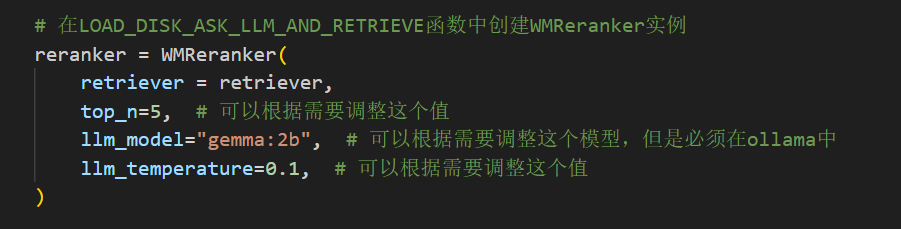
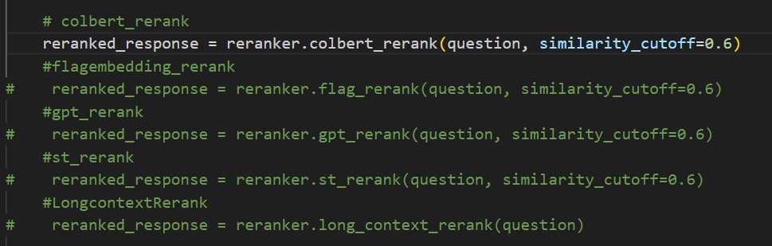

# 使用
将跑通的几个Reranker添加进去了。包括：Colbert Rerank、FlagEmbeddingReranker、RankGPTReranker、SentenceTransformerRerank（Jina因为api有限额没进行添加，Longcontext Rerank加在colbert后面得到的回答 答非所问）

## 使用示例：
### 导入
~~~
from WisdoM import WMReranker
~~~
### 接着创建实例：
~~~
# 在LOAD_DISK_ASK_LLM_AND_RETRIEVE函数中创建WMReranker实例
    reranker = WMReranker(
        retriever = retriever,
        top_n=5,  # 可以根据需要调整这个值
        llm_model="gemma:2b",  # 可以根据需要调整这个模型，但是必须在ollama中
        llm_temperature=0.1,  # 可以根据需要调整这个值
    )
~~~
尝试了使用Longcontextreranker，但是效果感觉明显差很多然后没有加上去。

### 调用重排方法（相似度可以修改，默认是0.6）：
**colbert_rerank**
~~~
    reranked_response = reranker.colbert_rerank(question, similarity_cutoff=0.6)
~~~
**flagembedding_rerank**
~~~    
    reranked_response = reranker.flag_rerank(question, similarity_cutoff=0.6)
~~~
**gpt_rerank**
~~~
    reranked_response = reranker.gpt_rerank(question, similarity_cutoff=0.6)
~~~
**st_rerank**
~~~
    reranked_response = reranker.st_rerank(question, similarity_cutoff=0.6)
~~~
**Long_context_rerank**
~~~
    reranked_response = reranker.long_context_rerank(question)
~~~

### 打印回答：
~~~
    #显示重排后的回答
    print(reranked_response)
~~~
